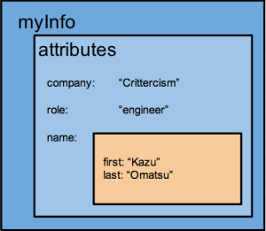
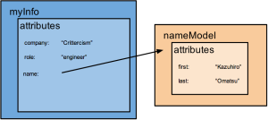
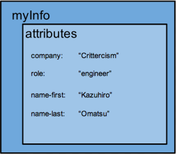

#backbone nest model

Here at Crittercism, we’ve been developing our latest features in Backbone.js to provide a better user experience for our customers. Backbone.js provides full event-driven communication between models and views, all in a small 6.5kb (packed and gzipped) package. It’s known to be a relatively un-opinionated library as opposed to other fully-featured javascript frameworks, allowing the developer more freedom to design their code as they please. With this freedom, though, comes lots of debate on best practices. One thing that many Backbone.js developers differ on is how to handle nested attributes within models. If a developer is working with an API that has nested model data, what are some ways to handle it?

Say you have some model, called User.

````js
var User = Backbone.Model.extend({...});
````

Every instance of foo has two properties, “company” and “role”.

````
var myInfo = new User({company: "Crittercism", role: "engineer"});
````
Create a view that is bound to this instance of User.

````js
var UserInfoView = Backbone.View.extend({
  initialize: function() {
    this.listenTo(this.model, "change", this.render, this);
  },
  render: function() {
    this.$el.html(JSON.stringify(this.model.attributes));
  }
});

var myInfoView = new UserInfoView({model: myInfo});
$("#userInfoContainer").html(myInfoView.render().$el);
````

Now, whenever the attributes of myInfo updates, the view re-renders itself with the updated values.
But what if myInfo had a nested object?

````js
myInfo.set({
  name: {first: "Kazu", last: "Omatsu"}
});
````

The div properly updates with the values of the nested “name” object.





What if we want to update either name.first or name.last?

````js
var updatedName = myInfo.get("name");
updatedName.first = "Kazuhiro"; //Change my first name
myInfo.set("name", updatedName);
````

myInfo.name.first is now set to “Kazuhiro”.. BUT WAIT! You will notice that the rendered values never changed.
Because the object reference to which myInfo.attributes.name has not changed, Backbone.Model does not fire the “change” and the attribute-specific “change:name” events. In other words, the inner contents of myInfo.name have changed to “Kazuhiro”, but the reference to myInfo.attributes.name has not changed at all and still points to the same instance of the object. Any Backbone.Model.validation() that was defined is also not run for the same reason.

What, then, are some ways to deal with this such that the model-view binding will function as expected?

##### Solution 1: Model-ception

There’s a solution on StackOverflow that seems to have a lot of upvotes. The proposed solution is to make the nested object an instance of a Backbone.Model. However, I see a couple of big issues with this approach.

````js
var nameModel = new Backbone.Model({first: "Kazu", last: "Omatsu"});
myInfo.set({name: nameModel});
````

Now, you can “get” the nested model, and run a “set” on its attribute to update the value.

````js
myInfo.get("name").set("first", "Kazuhiro");
````


Uh oh, that still doesn’t update the view. That’s the first issue with this approach. Why does it not update? Because myInfoView is bound to “change” events of the myInfo model, NOT the nested model in myInfo.attributes.name.

Therefore, you’ll have to add the following event-binding before the view will properly update with the above setter code:

````js
myInfoView.listenTo(myInfoView.model.get("name"), "change", myInfoView.render, myInfoView);
````

Another issue with this approach is the JSON-ification of the attributes. Try logging out the JSON-ified version of the model.
````js
console.log(myInfo.toJSON())
````

This prints out:

````js
Object {company: "Crittercism", role:"engineer", name: Backbone.Model}
````

Why is this a problem?

Say you’re working with a well-designed API, such that you later want to save any updates back up to the server with a Backbone.Model.save() or .sync() call. If you trace through Backbone.js’s source code, you will see that the model will attempt to pass a JSON-ified version of its attributes in the request. That JSON-ified data is obtained via a call to Backbone.Model.toJSON(), so “name” in this case would not have the expected object being passed up to the server. One would have to override User.prototype.toJSON() to be able to extract name.attributes into the JSON, which is less than ideal.

#####Solution 2: Flatten It

If the nested attributes structure is being returned from the server via a Backbone.Model.fetch() or .save(), then it can be parsed and flattened before it gets saved as part of the model’s attributes. Backbone.Model.parse(), which is designed to be overridden, is automatically called after .fetch() and .save(). In that function, you can structure the incoming response however you please, and return the attributes hash to be set on the model. Say that your fetch() call returned a nested response structure:

````js
var response = {
  company: "Crittercism",
  role: "engineer",
  name: {
    first: "Kazu",
    last: "Omatsu"
  }
}
````

You can override parse() like this:

````js
User.prototype.parse = function(response) {
  var attr = response && _.clone(response) || {};
  if (response.name) {
     for (var key in response.name) {
       if (response.name.hasOwnProperty(key)) {
         attr["name-" + key] = response.name[key]
       }
     }
     delete attr.name;
  }
  return attr;
};
````

This will flatten out “name.first” and “name.last” to be “name-first” and “name-last”, so now you can modify the values via the set() method:

````js
myInfo.set("name-first", "Kazuhiro");
````
 

Again, though, there are problems with this approach.

- In the example above, the div will now say {company: ”Crittercism”, role:”engineer”, name-first: “Kazuhiro”, name-last: “Omatsu”} which may not be what we want.
- We’ll run into the same JSON-ification issues as the first solution. You will have to keep track of the “name-*” keys and remember to un-nest them later, via an override for toJSON().
- What if other attributes can be nested objects? You would have to modify parse() to handle all of them. Or worse yet, what if your last name was broken up further into name.last.premarriage and name.last.postmarriage?

#####Solution 3: The Clone Wars
Assuming that your nested attributes are a modest size, we can use Underscore.js’s handy _.clone() method. This method returns a shallow-clone of the specified object.

````js
var updatedName = _.clone(myInfo.get("name"));
updatedName.first = "Kazuhiro";
myInfo.set("name", updatedName);
````


Wasn’t that easy? The validation, “change”, and “change:name” events fire properly, since myInfo.attributes.name now points to a brand-new cloned object. The view gets updated as a result, and the JSON-ified model attributes also have the proper structure.

For cases like these, we at Crittercism generally like to use Solution 3. There are times where other solutions are more appropriate, though. The beauty of Backbone.js is that it is up to each developer’s discretion to determine what the best development pattern is, so always use your best judgment.

I’ve uploaded an example app containing the three solutions listed above on my Github repo.

